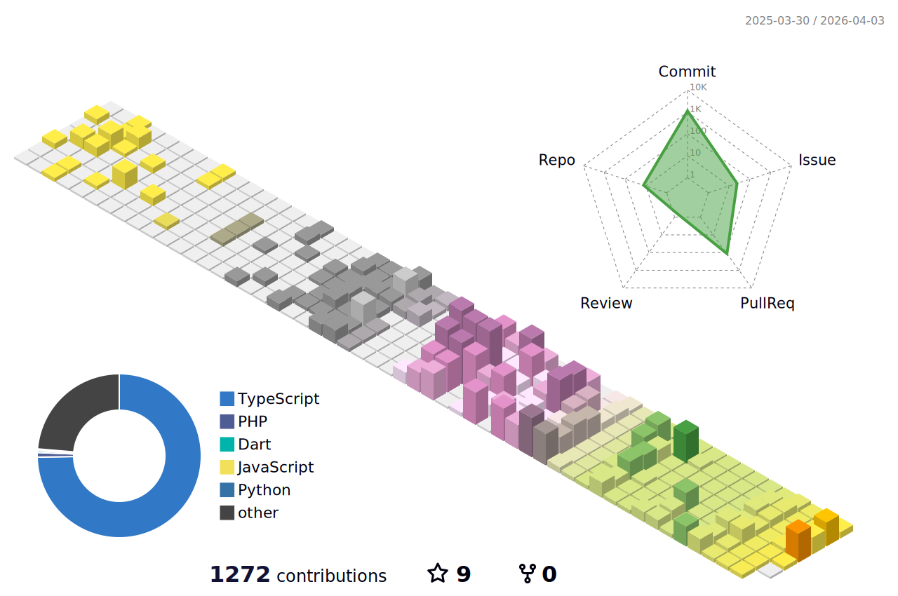

<h3 align = 'center'>Hey There 👋</h3>
<h1 align = 'center'> I'm Rai M. Reyes Jr.</h1>

  

<h4 align = 'center'>Aspiring </h4> 
<h2 align = 'center'>Software Developer ✨| Web Developer ✨| Graphic Designer ✨</h2>
   <h3 align = 'center'> From the Philippines</h3>

   
   <h3 align = 'center'> Socials</h3>

   
  
   
   

 
 
<h5 align='center'> LANGUAGES </h5>
 

 

   

   
 

   

   

     
   

 
 

 

 💬📫 - You can message me through:<a href=""> raireyesjr@gmail.com</a>
  

<!--
**DevAdora/DevAdora** is a ✨ _special_ ✨ repository because its `README.md` (this file) appears on your GitHub profile.

Here are some ideas to get you started:

- 🔭 I’m currently working on ...
- 🌱 I’m currently learning ...
- 👯 I’m looking to collaborate on ...
- 🤔 I’m looking for help with ...
- 💬 Ask me about ...
- 📫 How to reach me: ...
- 😄 Pronouns: ...
- ⚡ Fun fact: ...
-->
