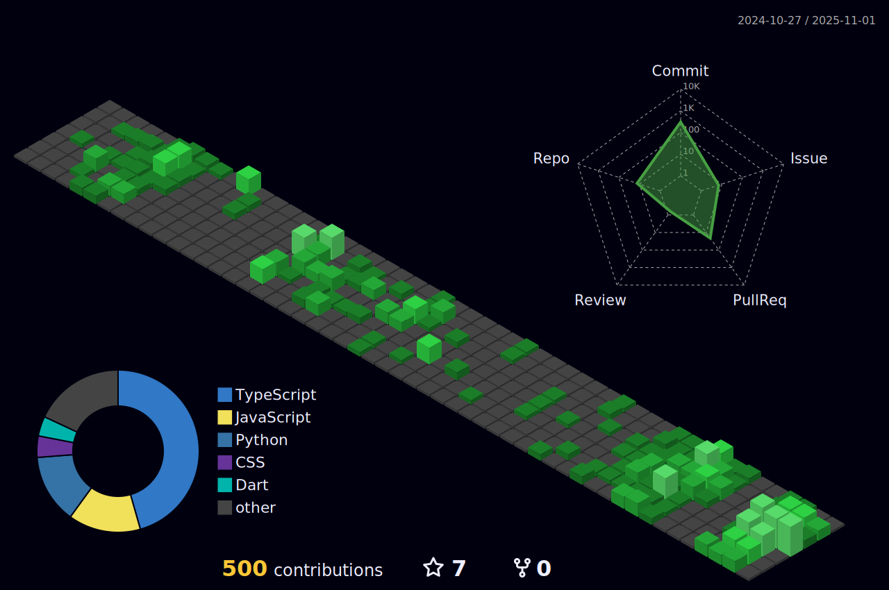

## 🎯 About Me

Hello! I'm Devadora, an IT Graduate and freelancer aiming to become a defined variable in the industry. I enjoy working on projects that involve software development. When I'm not coding, you can find me either lost in video games 🎮, reading a book or binge-watching some movies or series! 

- 🌍 **Location:** Philippines
- 🎓 **Education:** Bachelor of Science in Information Technology, 2025
- 💼 **Current Role:** Looking for Job 😭
- 🌱 **Currently learning:** React, Vite, Framer and GSA

### 🛠️ Techy Stacky

  <!-- Languages -->
  
  
  
  
  
  
  
  
  
  
  
  
  
  
  
  

  

<!--
- **Languages:** JavaScript, Python, HTML/CSS, C++, Wordpress, VB.Net, Dart, React Native, PHP
- **Frameworks:** React, Tailwind CSS, Bootstrap, Node, Express, Expo, NextJS, Flutter
- **Databases:** MySQL, MongoDB, Firebase, PostgreSQL, Supabase
- **Libraries:** ShadCN, ShadCN UI, React Redux, GSAP
- **Version Control:** Git, GitHub, XAMPP
- **Hosting:** Vercel and Netlify

   <h3 align = 'center'> Socials</h3

   
  
   
   

--> 
 
 

<!--  -->

<!--
**DevAdora/DevAdora** is a ✨ _special_ ✨ repository because its `README.md` (this file) appears on your GitHub profile.

Here are some ideas to get you started:

- 🔭 I’m currently working on ...
- 🌱 I’m currently learning ...
- 👯 I’m looking to collaborate on ...
- 🤔 I’m looking for help with ...
- 💬 Ask me about ...
- 📫 How to reach me: ...
- 😄 Pronouns: ...
- ⚡ Fun fact: ...
-->
